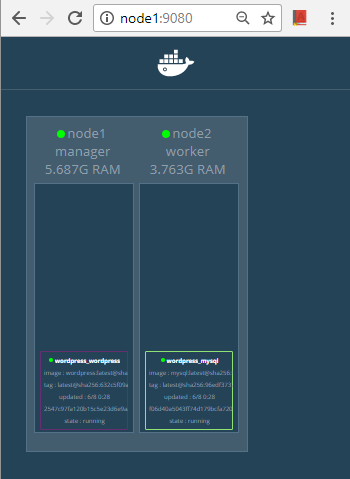

# Clear Score Devops Challenge

This is a challenge where you can showcase your technical skills and the considerations which you make when performing devops and infrastructure tasks. Your solution may be as simple or complex as you like, provided it meets the requirements below, and will serve as a discussion point when you come in to meet us. You should not need to spend more than an hour or two on the challenge.

### The Brief
You have been asked to create a web site which can be used for publishing blogs. As a proof of concept, it will be sufficient that you demonstrate a website that displays text (e.g. *Lorem Ipsum* <https://en.wikipedia.org/wiki/Lorem_ipsum> and an image on a single home page.

You can create your own application but can also use an open source or community software, such as Wordpress <https://wordpress.org> or Keystone <http://keystonejs.com> (or even use static content). **This proof of concept is to demonstrate the technical feasibility of hosting and, managing and scaling the platform and is not about content**.

You must meet the following requirements:

- Deliver the tooling to set up an application which displays a web page with *Lorem Ipsum* text and an image
- Provide source code for creating the stack in a publically available repository, e.g. Github <https://github.com>
- Provide and document a mechanism for scaling the service and delivering the content to a larger audience
- Provide basic setup documentation to run the application
- Be prepared to explain your choices

How you host this application is entirely up to you. You can provide tooling to run it locally or link to an instance running in the cloud. Please bear in mind, however, that we are trying to gauge your aptitude for designing and working with web-scale solutions and technologies, so any solution must demonstrate that you have considered how a real-world solution will be hosted and scaled.

Good luck, have fun and we look forward to hearing from you!

# One possible solution by __Shahzad Chaudhry__
This is a simple solution to the DevOps challenge set above:
- [Vagrant](https://www.vagrantup.com/docs/index.html) will be used to provision infrastructure on a local machine for the testing of WordPress stack
- [Docker Community Edition for AWS](https://docs.docker.com/docker-for-aws/#docker-community-edition-ce-for-aws) will be used to provision infrastructure in AWS. This is for public facing blogs
- Docker will be used both as a container and orchestration technologies for standing up WordPress stack. The provided docker compose file will run anywhere Docker is installed. So, it is cloud / platform agnostic
  - Docker version 17.06.0-ce was used for testing this solution

### 1) Local infrastructure with Vagrant:
1.1) *Assumptions:*
- Development machine is a Windows 10 laptop.
- User has admin privileges on the machine
- At least 10GB of free RAM is available on the development machine. Otherwise, Vagrantfile will need editing to adjust available memory:
  -	`v.customize ["modifyvm", :id, "--memory", <MEMORY_ALLOCATION>]`

1.2) *Prerequisites:*
  -	Install latest version of  [Git bash](https://git-scm.com/downloads)
  -	Install latest version of [VirtualBox](https://www.virtualbox.org/wiki/Downloads)
  -	Install latest version of  [Vagrant](https://www.vagrantup.com/intro/getting-started/install.html)
  -	Install [Vagrant Host Manager](https://github.com/devopsgroup-io/vagrant-hostmanager) plugin by running ```vagrant plugin install vagrant-hostmanager``` in Git bash. This will update host files on both guest and host machines when running "*vagrant up*" command.

1.3) *Instructions:*
  - `git clone https://github.com/shazChaudhry/ClearScore_Devops_Challenge.git`
  - `cd ClearScore_Devops_Challenge`
  -	Run ```vagrant up``` command which will setup a Docker swarm cluster; 1xMaster and 1xWorker. Once infrastructure is created then in gitbash, run ```vagrant ssh node1``` to log into the swarm manager node. This is where WordPress stack will need to be deployed
  - Infrastructure visualizer is available at [http://node1:9080](http://node1:9080). You should see two nodes; one of which is a docker swarm manager and the second one is a docker swarm worker <br /> 

  - `cd /vagrant`
  - Next, move on to the "Deploy WordPress stack" section below in order to deploy WordPress stack

### 2) AWS infrastructure with Docker:
2.1) *Create a new VPC:*

This approach creates a new VPC, subnets, gateways, and everything else needed in order to run Docker for AWS. It is the easiest way to get started, and requires the least amount of work. All you need to do is run the CloudFormation template, answer some questions, and you are good to go.

2.2) *Prerequisites:*
- SSH key in AWS in the region where you want to deploy (required to access the completed Docker install)
- Access to an AWS account with permissions to use CloudFormation and creating the following objects
  - EC2 instances + Auto Scaling groups
  - IAM profiles
  - DynamoDB Tables
  - SQS Queue
  - VPC + subnets and security groups
  - ELB
  - CloudWatch Log Group

2.3) *Instructions:*

- Instructions on how to create a docker swarm cluster in AWS is fully documented at https://docs.docker.com/docker-for-aws/#docker-community-edition-ce-for-aws. For the purpose of creating this solution, [Docker CE for AWS - Stable](https://console.aws.amazon.com/cloudformation/home#/stacks/new?stackName=Docker&templateURL=https://editions-us-east-1.s3.amazonaws.com/aws/stable/Docker.tmpl) was used.
- Once AWS infrastructure is created, connect to your manager node by following instructions at https://docs.docker.com/docker-for-aws/deploy/#manager-public-ip-on-aws
  - eval $(ssh-agent -s) or ssh-agent -s
  - ssh-add path-to-ssh-key
  - ssh -i path-to-ssh-key docker@ssh-manager-host
- EC2 instances just created are Alpine Linux based. Git client will need to be installed by running `sudo apk update && sudo apk add git && sudo apk add openssl`
- Start visualizer service by running
```
docker service create \
--name=visualizer \
--publish=9080:8080/tcp \
--constraint=node.role==manager \
--mount=type=bind,src=/var/run/docker.sock,dst=/var/run/docker.sock \
dockersamples/visualizer
```
This visualizer should then be available at [http://docker-externalloa-rmkl6efmvpdb-1986224484.eu-west-2.elb.amazonaws.com:9080/](http://docker-externalloa-rmkl6efmvpdb-1986224484.eu-west-2.elb.amazonaws.com:9080/)
- `git clone https://github.com/shazChaudhry/ClearScore_Devops_Challenge.git`
- `cd ClearScore_Devops_Challenge`
- Move on to the "Deploy WordPress stack" section below in order to deploy WordPress

### 3) Deploy WordPress stack
Once you have a docker swarm cluster / infrastructure up and running, ssh on to the master node in gitbash. Then create secrets to be used with MySQL and WordPress and then deploy WordPress stack using a compose file. Follow these instructions:
1. `openssl rand -base64 20 | docker secret create mysql_password -`
2. `openssl rand -base64 20 | docker secret create mysql_root_password -`
3. `docker stack deploy -c docker-compose.yml wordpress`
4. `docker stack services wordpress`. Wait until all replicas are reported as deployed.

### 4) Configure WordPress
- Navigate to [http://node1](http://node1) for local infrastructure or [http://docker-externalloa-rmkl6efmvpdb-1986224484.eu-west-2.elb.amazonaws.com/](http://docker-externalloa-rmkl6efmvpdb-1986224484.eu-west-2.elb.amazonaws.com/) for AWS to configure WordPress
- Configure you language and press continue button
- Configure user credentials and press install button
- Once configuration is successful, log in with your credentials
- Create your first blog

### 5) Rotate a secret
- In this scenario, you create a new secret with a new MySQL password, update the mysql and wordpress services to use it, then remove the old secret.
- Use the instructions here: https://docs.docker.com/engine/swarm/secrets/#example-rotate-a-secret

### 6) Clean up
- **Vagrant** - Exit the docker swarm master node and execute `vagrant destroy` to destroy virtual boxes
- **AWS** -  Delete the stack from the CloudFormation service page

### 7) References
- [Vagrant](https://www.vagrantup.com/docs/index.html)
- [Docker Community Edition for AWS](https://docs.docker.com/docker-for-aws/#docker-community-edition-ce-for-aws)
- [Use secrets with a WordPress service](https://docs.docker.com/engine/swarm/secrets/#advanced-example-use-secrets-with-a-wordpress-service)
